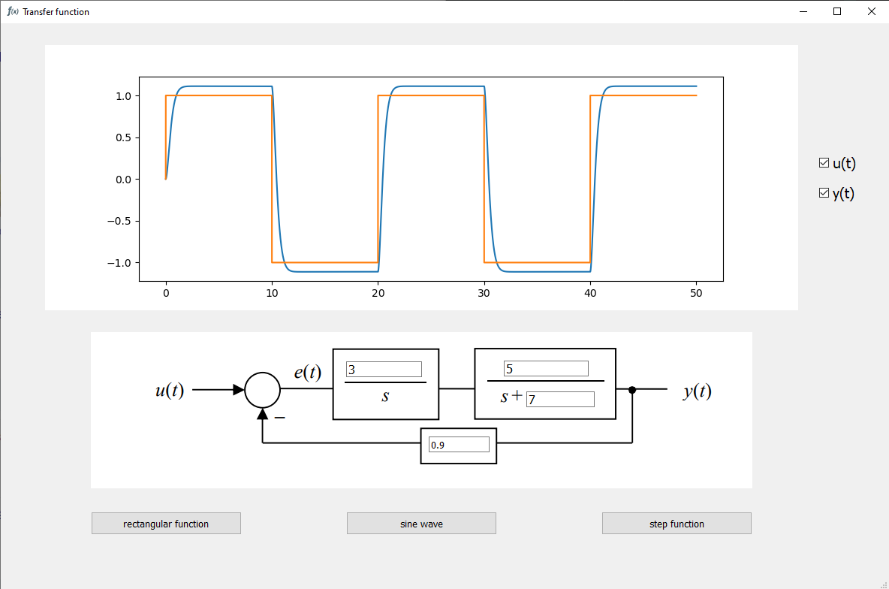
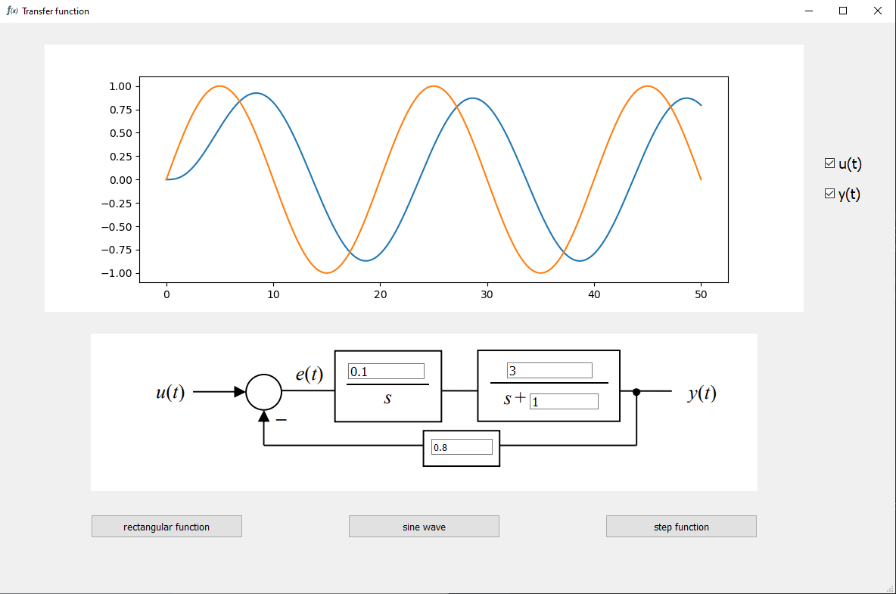

# Closed-loop transfer function graph
> Scientific project for a course in college. It shows output and input of closed-loop transfer function.

## Table of contents
* [General info](#general-info)
* [Screenshots](#screenshots)
* [Technologies](#technologies)
* [Features](#features)
* [Status](#status)
* [Contributors](#contributors)
## General info
Scientific project for mathematical modeling course. We presented how looks output of closed-loop transfer function. A model may help to explain how system works and to make predictions about behavior for real engineering situations.

## Screenshots

## Technologies
* Python 3.8
* PyQt5
* Matplotlib

## Features
* user-entered variables
* plotting Matplotlib graph in PyQT Gui
* numerical integration with Taylor's theorem

## Status
Project is finished.

## Contributors
* https://github.com/MD-00
